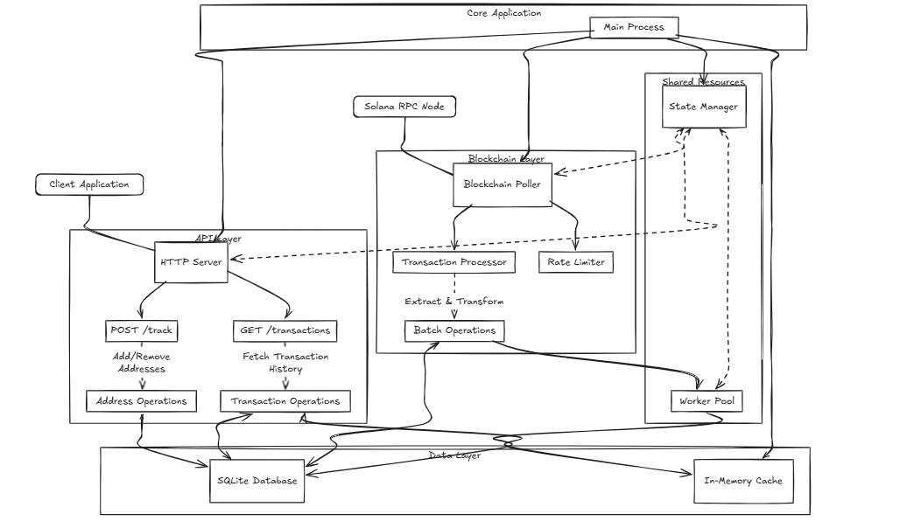

# Solana Transaction Tracker Microservice


A high-performance, production-ready microservice for tracking and querying Solana blockchain transactions with efficient caching, batched processing, and concurrent execution.

## Table of Contents

- [Overview](#overview)
- [Architecture](#architecture)
- [Features](#features)
- [Requirements](#requirements)
- [Installation and Setup](#installation-and-setup)
- [Configuration](#configuration)
- [API Documentation](#api-documentation)
- [Performance Optimizations](#performance-optimizations)
- [Testing](#testing)
- [License](#license)

## Overview

This microservice provides a robust backend for tracking transactions on the Solana blockchain for specific addresses. It exposes RESTful endpoints for adding/removing tracked addresses and querying their transaction history with efficient pagination. The service maintains its own database for optimized query performance and implements caching to reduce both database load and Solana RPC requests.

## Design Rationale

### Technology Choices

- **Rust**: Selected for its memory safety, performance, and excellent concurrency support - critical for handling blockchain data processing
- **Axum**: Chosen over other frameworks like Actix-Web for its lightweight nature, excellent async support, and tight Tokio integration
- **SQLite**: Preferred over PostgreSQL for its simplicity in deployment and sufficient performance for the expected workload. The file-based nature makes it ideal for this self-contained service
- **Moka**: Selected over Redis for in-memory caching due to its native Rust implementation and elimination of additional infrastructure dependencies

### Architectural Decisions

1. **Dual-Process Architecture**
   - Separated HTTP server and blockchain listener to prevent request handling from blocking transaction processing
   - Uses `Arc<Mutex<T>>` for safe state sharing between processes, optimizing for both safety and performance

2. **Caching Strategy**
   - Implemented LRU caching with time-based invalidation to balance memory usage with performance
   - Cache keys designed around query patterns to maximize hit rates
   - Adaptive TTL implementation reduces RPC calls for historical data

3. **Database Design**
   - Optimized schema with carefully selected indexes for query patterns
   - Implemented batch processing to reduce I/O operations
   - Used SQLite's WAL mode for better concurrent access

4. **Concurrency Model**
   - Worker pool pattern for parallel processing
   - Non-blocking I/O throughout the system
   - Careful lock scoping to minimize contention

These design choices prioritize:
- Operational simplicity
- Predictable performance
- Resource efficiency
- Maintainable codebase
- Production readiness

### Key Capabilities

- Track specific Solana wallet addresses
- Query historical transaction data with time-range filtering
- Concurrent processing of blockchain data and API requests
- Optimized for high throughput with batched database operations
- Memory-efficient caching with time-based invalidation

## Architecture



The service consists of several core components that work together:

### Component Overview

- **API Layer**: Axum-based HTTP server exposing REST endpoints
- **Blockchain Integration**: Solana RPC client with retry and rate-limiting
- **Database Layer**: SQLite with connection pooling and optimized schema
- **Caching Layer**: In-memory LRU cache with Moka
- **Background Processing**:
  - Transaction polling worker
  - Batch processing manager
  - Worker pool for parallel execution

### Concurrency Model

The service operates two main concurrent processes:

1. **HTTP Server**: Handles incoming API requests
2. **Blockchain Listener**: Polls for new transactions in the background

These processes run independently but share state safely through thread-safe wrappers (`Arc<Mutex<T>>`). The worker pool distributes database operations across multiple worker threads for optimal performance.

## Features

- **Address Tracking**: Add or remove addresses to monitor
- **Transaction Querying**: Retrieve historical transactions with filtering
- **Pagination Support**: Fetch transactions in pages with offset and limit
- **Time Range Filtering**: Query transactions within specific time windows
- **Concurrent Processing**: Non-blocking architecture for high throughput
- **Efficient Caching**: In-memory caching reduces database and RPC load
- **Rate Limiting**: Prevents RPC endpoint throttling
- **Automatic Retries**: Handles transient network failures gracefully
- **Batched Database Operations**: Optimizes database write performance

## Requirements

- Rust 1.68+
- SQLite 3.35+
- Access to a Solana RPC endpoint

## Installation and Setup

### From Source

```bash
# Clone the repository
git clone https://github.com/degencodebeast/chain-data-service
cd chain-data-service

# Copy example configuration
cp .env.example .env

# Edit configuration (especially set your Solana RPC URL)
nano .env

# Build the project
cargo build --release

# Run the service
cargo run --release
```
<!-- 
### Using Docker

```bash
# Build the Docker image
docker build -t solana-transaction-tracker .

# Run the container
docker run -d \
  --name solana-tracker \
  -p 8080:8080 \
  -v ./data:/app/data \
  -e SOLANA_RPC_URL=https://your-rpc-endpoint.com \
  solana-transaction-tracker
``` -->

<!-- ### Docker Compose

```bash
# Start the service using docker-compose
docker-compose up -d
``` -->

## Configuration

The service is configured via environment variables, which can be set in a `.env` file:

```
# Solana Configuration
SOLANA_RPC_URL=https://api.mainnet-beta.solana.com
SOLANA_COMMITMENT_LEVEL=confirmed
RPC_TIMEOUT_SECS=30
RPC_RATE_LIMIT=5

# Database Configuration
DATABASE_URL=sqlite:data.db

# Server Configuration
SERVER_HOST=127.0.0.1
SERVER_PORT=8080

# Worker Configuration
POLLING_INTERVAL_SECS=10
WORKER_COUNT=4

# Cache Configuration
CACHE_TTL=60
CACHE_MAX_CAPACITY=10000
```

| Variable | Description | Default |
|----------|-------------|---------|
| `SOLANA_RPC_URL` | URL of the Solana RPC endpoint | https://api.mainnet-beta.solana.com |
| `SOLANA_COMMITMENT_LEVEL` | Transaction finality level | confirmed |
| `RPC_TIMEOUT_SECS` | Timeout for RPC requests in seconds | 30 |
| `RPC_RATE_LIMIT` | Maximum RPC requests per second | 5 |
| `DATABASE_URL` | SQLite database location (supports $PWD expansion) | sqlite:$PWD/data.db |
| `SERVER_HOST` | Server listening address | 127.0.0.1 |
| `SERVER_PORT` | Server listening port | 8080 |
| `POLLING_INTERVAL_SECS` | Blockchain polling frequency in seconds | 10 |
| `WORKER_COUNT` | Number of worker threads | (CPU core count) |
| `CACHE_TTL` | Cache time-to-live in seconds | 60 |
| `CACHE_MAX_CAPACITY` | Maximum number of cache entries | 1000 |
| `RUST_LOG` | Logging level (error, warn, info, debug, trace) | info |
| `SQLX_OFFLINE` | Enable SQLx offline mode for development | false |

## API Documentation

### POST /track

Track or untrack a Solana wallet address.

#### Query Parameters

| Parameter | Type | Description |
|-----------|------|-------------|
| address | string | The Solana wallet address to track |
| action | string | Either "add" or "remove" |

#### Response Codes

- `201 Created`: Address added successfully
- `200 OK`: Address removed successfully
- `400 Bad Request`: Invalid parameters
- `500 Internal Server Error`: Server error

#### Examples

```bash
# Add an address to tracking
curl -X POST "http://localhost:8080/track?address=9QDsSXnWXZ3z8zpQ9ezxd3hSbqfxdj9p5QZW3dNMaV72&action=add"

# Remove an address from tracking
curl -X POST "http://localhost:8080/track?address=9QDsSXnWXZ3z8zpQ9ezxd3hSbqfxdj9p5QZW3dNMaV72&action=remove"
```

### GET /transactions

Retrieve transactions for a tracked address within a specified time range.

#### Query Parameters

| Parameter | Type | Description |
|-----------|------|-------------|
| address | string | The Solana wallet address to query |
| start_time | int | Start timestamp (Unix seconds, inclusive) |
| end_time | int | End timestamp (Unix seconds, exclusive) |
| offset | int | Number of records to skip |
| limit | int | Maximum number of records to return |

#### Response Headers

- `X-Total-Count`: Total number of transactions matching the query

#### Response Body

```json
{
  "data": [
    {
      "signature": "2xNwoPTHD1WpKPid3UEjDEZFvP3PJMSUVEBnrGHjk3UPpT9xG4LRBvdLwk3aP3v4WJRVdbEJGRfpbmxpnA9NkiF9",
      "block_time": 1628789765,
      "slot": 92379551,
      "source_address": "9QDsSXnWXZ3z8zpQ9ezxd3hSbqfxdj9p5QZW3dNMaV72",
      "destination_address": "DrUdzADxrhtFVYG8BqazRsjsPaZbLmzE5EbtevnAB39i",
      "amount": 0.1,
      "program_id": "11111111111111111111111111111111",
      "success": true
    },
    // More transactions...
  ]
}
```

#### Response Codes

- `200 OK`: Successful query
- `400 Bad Request`: Invalid parameters
- `404 Not Found`: Address not being tracked
- `500 Internal Server Error`: Server error

#### Examples

```bash
# Get transactions for a specific address in a time range
curl "http://localhost:8080/transactions?address=9QDsSXnWXZ3z8zpQ9ezxd3hSbqfxdj9p5QZW3dNMaV72&start_time=1628000000&end_time=1628900000&offset=0&limit=10"
```

## Database Schema

The service uses SQLite with the following schema:

### Tables

#### tracked_addresses
- `address` TEXT PRIMARY KEY - The Solana wallet address to track
- `added_at` INTEGER NOT NULL - Timestamp when the address was added (Unix time)

#### transactions
- `signature` TEXT PRIMARY KEY - Unique transaction signature
- `block_time` INTEGER NOT NULL - Transaction timestamp (Unix time)
- `slot` INTEGER NOT NULL - Solana blockchain slot number
- `source_address` TEXT NOT NULL - Sender address (FOREIGN KEY to tracked_addresses)
- `destination_address` TEXT - Recipient address (can be NULL, FOREIGN KEY to tracked_addresses)
- `amount` REAL - Transaction amount (can be NULL for non-transfer transactions)
- `program_id` TEXT - Program ID that processed the transaction (can be NULL)
- `success` BOOLEAN NOT NULL - Whether the transaction succeeded

### Indexes
- `idx_transactions_source_time` - On (source_address, block_time) for efficient address + time range queries
- `idx_transactions_destination_time` - On (destination_address, block_time) for efficient queries
- `idx_transactions_time` - On (block_time) for time range filtering

## Performance Optimizations

This service implements several optimizations to ensure high performance:

### Database Optimizations

- **Connection Pooling**: Reuses database connections to reduce overhead
- **Write-Ahead Logging (WAL)**: Enables concurrent reads/writes in SQLite
- **Batch Processing**: Groups database writes to reduce I/O operations
- **Optimized Schema**: Carefully designed indices for query performance
- **Prepared Statements**: Reduces parsing overhead for repeated queries

### Caching Strategy

- **LRU Eviction**: Automatically removes least recently used entries when capacity is reached
- **Time-Based Expiration**: Ensures data freshness with TTL configuration
- **Query-Based Keys**: Cache keys incorporate all query parameters for precise retrieval
- **Adaptive TTL**: Longer expiration for historical data, shorter for recent data

### RPC Client Optimizations

- **Rate Limiting**: Prevents overloading RPC endpoints
- **Exponential Backoff**: Intelligent retry strategy for failed requests
- **Connection Reuse**: Maintains persistent connections to reduce overhead
- **Batch Requests**: Combines multiple data fetches where possible

### Concurrency Optimizations

- **Worker Pool**: Distributes work across multiple threads
- **Non-Blocking I/O**: Fully asynchronous design with Tokio
- **Batch Manager**: Efficiently groups operations for processing
- **Lock Minimization**: Careful lock scoping to prevent contention

## Testing

The project includes comprehensive automated tests:

### Running Tests

```bash
# Run all tests
cargo test

# Run specific test binaries
cargo run --bin test_api
cargo run --bin test_blockchain
cargo run --bin test_concurrency
cargo run --bin test_transaction
cargo run --bin test_address
cargo run --bin test_db
```

### Test Coverage

- **Unit Tests**: Test individual components in isolation
- **Integration Tests**: Test API endpoints with a live server
- **Concurrency Tests**: Validate proper behavior under concurrent load
- **Cache Tests**: Verify cache behavior and performance

### Code Structure

- `src/api/`: API endpoints and error handling
- `src/blockchain/`: Solana RPC client and transaction processing
- `src/cache/`: Caching implementation
- `src/db/`: Database operations and schema
- `src/models/`: Data structures
- `src/validation/`: Input validation logic
- `src/bin/`: Executable binaries including test utilities

## License

This project is licensed under the MIT License - see the LICENSE file for details.

---

